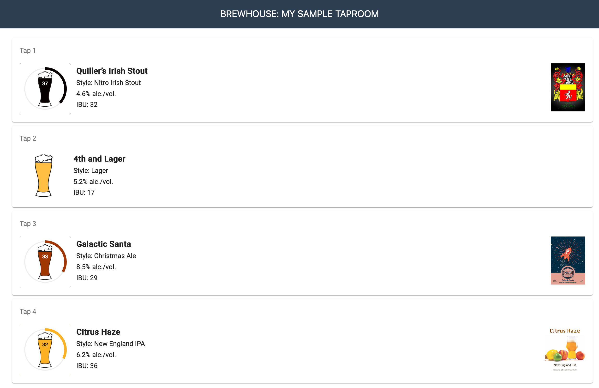

# Brewhouse Manager

The Brewhouse Manager is an open source application designed for the home/micro brewer to help track what they have
brewed and what they have on tap.  In order to make tracking you beer better, the Brewhouse Manager optionally
integrates with 3rd party brew systems and sensors to pull in your batch details and track the beer levels in your kegs.



## Supported Third Party Integrations

### Brew tracking applications

- [brewfather](https://brewfather.app/): The brewfather integration allows you to associate a batch with a beer to auto 
import details.  These details will refresh automatically until the batch is marked as completed.

### Senors

- [Plaato Keg](https://plaato.io/products/plaato-keg):  The Plaato Keg sensors allow you to track the current amount of
beer left in the keg.  These sensors can be associated with a specific tap to continuously track the levels
automatically even after you change kegs.  

## Quick Installation

The quickest way to start up the application is to run with Docker.  This requires a PostgreSQL database. If you want
to run the application with SSL or with along side a dedicated PostgreSQL database in docker, see the
[detailed installation guide](./docs/install.md).

1. Create a file named `docker.env` add add the following content, replacing the placeholder values with your DB
credentials and inital  

    ``` bash
    DB_USERNAME=<USERNAME>
    DB_PASSWORD=<PASSWORD>
    DB_NAME=<NAME OF DATABASE>
    DB_HOST=<DATABASE HOSTNAME>
    AUTH_INITIAL_USER_EMAIL=<YOUR EMAIL>
    AUTH_INITIAL_USER_PASSWORD=<>
    ```

2. Then run the following from the command to start the application.  This runs with the default configurations.  To enable more
advanced configurations, see the [detailed installation guide](./docs/install.md) or see the
[configuration options](./docs/configs.md) update your `docker.env`.

    ```shell
    docker run --env-file ./docker.env alanquillin/brewhouse-manager:latest
    ```

3. Once the application is up and running, go to `https://localhost:5000/manage` to start 
[managing your application](./docs/manage.md).  To log in, use credentials you added in the environment variables.  If
you did not add credentials for the initial user you will need to use the default credentials found in the
[default config](./config/default.json).

4. Once you have it all configured, you can monitor your taps at `http://localhost:5000`